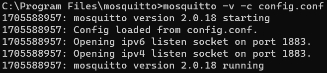

# mqtt2ros_android_example
This repository provides an example of how to establish a communication between an MQTT-based devices and a ROS2-based device.
The example was created using the following setup:
  * MQTT-based agent:
    * Android device
    * [`Eclipse Paho Android Service`](https://github.com/eclipse/paho.mqtt.android) is chosen to use MQTT
  * ROS-based agent:
    * Laptop running Ubuntu 22.04 through WSL2 on a Windows device
    * [`ROS2 Humble`](https://docs.ros.org/en/rolling/Releases/Release-Humble-Hawksbill.html) is chosen as ROS distribution
    * [`mqtt_client`](https://wiki.ros.org/mqtt_client) ROS package is used to map MQTT topics to ROS ones and viceversa

In the following, a description of how to configure the environment and run the example is provided. The steps can be slightly adapted to run the example with a different setup (_e.g.,_ using another ROS distribution)

## Environment configuration
### Configuration of the ROS-based device
1. Install ROS2 on your device.
   * The installation steps can vary depending on the device and ROS2 distribution that are being used. Please, refer to this [link](https://docs.ros.org/en/rolling/Releases.html) for the available distributions and follow the installation steps.
    For this example, `WSL2 - Ubuntu 22.04` is started and `ROS2Humble` is installed in the environment following the installation instructions provided [here](https://docs.ros.org/en/humble/Installation/Ubuntu-Install-Debians.html).
   
   * Set up the ROS2 environment by running:
     
     ```
     source /opt/ros/$ROS_DISTRO/setup.bash.
     ```
     To avoid repeating this step this every time you open a new terminal, modify your `~/.bashrc` file by adding the previous command
     Then, either close the terminal and open it again, or run:
     ```
     source ~/.bashrc
     ```
     In the first command, `$ROS_DISTRO` refers to the installed ROS2 distribution. In this example, `$ROS_DISTRO=humble`.
 
2. Install an MQTT broker to allow exchanging MQTT messages.
    * In this case, [`Eclipse Mosquitto`](https://mosquitto.org/) is used, and it can be downloaded from [here](https://mosquitto.org/download/). \
    Once installed, you may need to configure the firewall to allow incoming connections to the MQTT broker.
    For this example, `mosquitto` is installed on Windows 11.
    * To allow connections to `mosquitto` without the need of providing credentials, it is necessary to modify the configuration file of the MQTT broker.
      To do this, proceed as follows:
        * Navigate to `Mosquitto` installation folder (default is `C:\Program Files\mosquitto`)
        * Create a new configuration (`.conf`) file (_e.g._ my_config_file.conf)
        * Insert the following lines in the file and save it:
          
          ```
          listener 1883
          allow_anonymous true
          ```
      This will be used later on when starting the MQTT broker. The specified parameters are used to define the port on which mosquitto will wait for connections and the fact that anyone can connect to `Mosquitto` without the need of an authentication mechanism (**N.B.** this is not a good option in real scenarios).
    * Open a terminal and try to run the following commands to check that everything works:
      ```
      cd %MOSQUITTO_FOLDER%
      mosquitto -v -c %CONFIG_FILE%
      ```
      Here, `%MOSQUITTO_FOLDER%` is `Mosquitto` installation folder, while `%CONFIG_FILE%` is the path to the previously created configuration file.
      If everything works, the output should be something like this:
      
        
  
      
3. Install the `mqtt_client` ROS package needed to enable connected ROS-based devices to exchange ROS messages via an MQTT broker using the MQTT protocol, and exchange primitive messages with MQTT clients running on devices not based on ROS.
   * Run the following commands:
     
     ```
     sudo apt update
     sudo apt install ros-$ROS_DISTRO-mqtt-client -y
     ```
     
   Once installed, you can follow [this tutorial](https://wiki.ros.org/mqtt_client) to check that you can exchange MQTT messages successfully.
   **N.B.** If you are running on WSL2 and Mosquitto is installed on Windows, you need to modify the `mqtt_client` configuration `.yaml`, by adding the IP of your Windows machine, as done later in the instructions.
